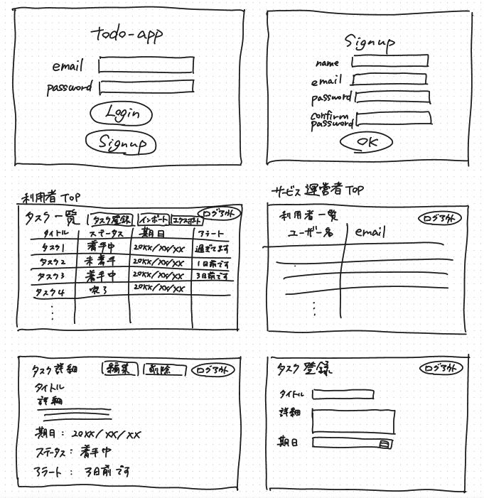

# タスク管理アプリ
## ER図
※ ●はNotNullを表す。

### users

| カラム名 | データ型 | 論理名 | 備考 |
| - | - | - | - |
| id | integer | ID |  |
| name | string | ユーザー名 |  |
| email | string | メールアドレス |  |
| psasword | string | パスワード |  |
| role_id | integer | ロールID |  |

### tasks

| カラム名 | データ型 | 論理名 | 備考 |
| - | - | - | - |
| id | integer | ID |  |
| title | string | タイトル |  |
| detail | text | 詳細 |  |
| deadline | date | 期限 |  |
| user_id | integer | ロールID |  |
| status_id | integer | ステータスID|  |

### roles

| カラム名 | データ型 | 論理名 | 備考 |
| - | - | - | - |
| id | integer | ID |  |
| name | string | ロール名 |  |

### statuses

| カラム名 | データ型 | 論理名 | 備考 |
| - | - | - | - |
| id | integer | ID |  |
| name | string | ステータス名 | |]

## 画面イメージ
