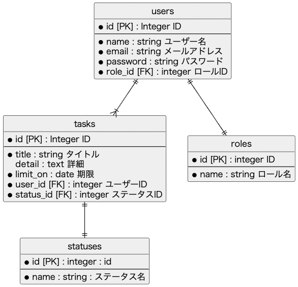

# タスク管理アプリ

## ER 図

※ ● は NotNull を表す。

### users

| カラム名 | データ型 | 論理名         | 備考 |
| -------- | -------- | -------------- | ---- |
| id       | integer  | ID             |      |
| name     | string   | ユーザー名     |      |
| email    | string   | メールアドレス |      |
| psasword | string   | パスワード     |      |
| role_id  | integer  | ロール ID      |      |

### tasks

| カラム名  | データ型 | 論理名        | 備考 |
| --------- | -------- | ------------- | ---- |
| id        | integer  | ID            |      |
| title     | string   | タイトル      |      |
| detail    | text     | 詳細          |      |
| limit_on  | date     | 期限          |      |
| user_id   | integer  | ロール ID     |      |
| status_id | integer  | ステータス ID |      |

### roles

| カラム名 | データ型 | 論理名   | 備考 |
| -------- | -------- | -------- | ---- |
| id       | integer  | ID       |      |
| name     | string   | ロール名 |      |

### statuses

| カラム名 | データ型 | 論理名   | 備考 |
| -------- | -------- | -------- | ---- |
| id       | integer  | ID       |      |
| name     | string   | ステータス名 |      |

## 画面イメージ

